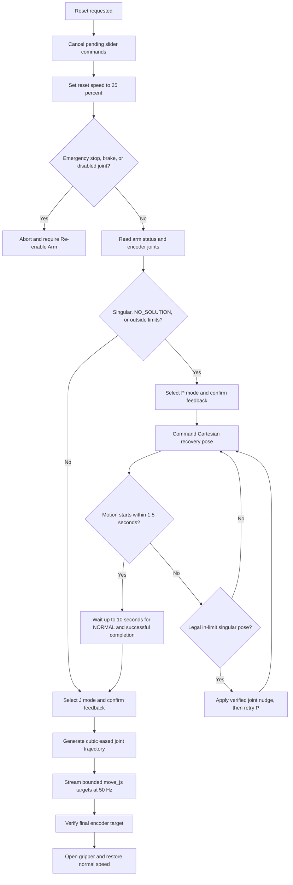

# NERO Robot Control Guide

This document records the hardware-tested lessons that made NERO arm control reliable and smooth with `pyAgxArm`, NERO firmware `v121`, and SocketCAN.

The current reference implementation is in `nero_lab.py`, build `2026-09-06-valid-grip-force-56`.

## Core Principles

1. Treat encoder feedback as the source of truth.
2. Confirm motion-mode feedback before sending a command.
3. Do not interpret `motion_status=REACH_TARGET_POS_FAILED` by itself as a fatal error.
4. Distinguish Cartesian kinematic faults from motor, brake, and emergency-stop faults.
5. Recover from singular or out-of-limit states before normal joint motion.
6. Use small, time-spaced `move_js` targets for smooth software-controlled motion.
7. Build partial joint targets from current encoder values so untouched joints do not move unexpectedly.
8. Verify target completion from encoders, not SDK return values. Most SDK motion calls return `None` even when accepted.

## Important Poses and Limits

### Upright reset

```python
UPRIGHT_RESET_JOINTS = [0.0] * 7
```

This is a useful reference pose, but it is also a kinematic singularity. At or near this pose, the controller commonly reports `SINGULARITY_POINT` or `NO_SOLUTION`. Reaching Upright successfully does not imply that the next Cartesian command will start reliably.

### Safe Bicep reset

```python
SAFE_BICEP_RESET_JOINTS = [
    0.0,
    -1.68,
    0.023,
    2.08,
    -0.026,
    0.076,
    1.50,
]
```

This is the preferred supported shutdown and recovery pose.

### Cartesian recovery pose

The Cartesian recovery target is computed with `arm.fk(SAFE_BICEP_RESET_JOINTS)`, producing the flange pose of Safe Bicep in the SDK's own NERO kinematic model. This lets P recovery move directly near the final reset pose before J control performs the encoder-exact correction. The former `[-0.4, 0.0, 0.4, -1.57, 0.0, -3.14]` recovery pose remains only as a compatibility fallback when SDK forward kinematics is unavailable or invalid.

### Reset and GUI command envelope

These values are a local application envelope used by reset recovery and GUI sliders. They are not controller-reported hardware limits and must not be applied to taught-task recording or replay.

| Joint | Minimum rad | Maximum rad |
|---|---:|---:|
| 1 | -2.705261 | 2.705261 |
| 2 | -1.745330 | 1.745330 |
| 3 | -2.757621 | 2.757621 |
| 4 | -1.012291 | 2.146755 |
| 5 | -2.757621 | 2.757621 |
| 6 | -0.733039 | 0.959932 |
| 7 | -1.570797 | 1.570797 |

Generated recovery targets use a `0.005` radian margin inside these limits.

An arm can report `arm_status=NORMAL` while its encoders are outside these limits. This can happen after emergency braking or physical sag. In that state, normal `move_j` targets may be rejected even when the requested target is legal. Use Cartesian recovery first.

## Connection and Re-enable Behavior

### Clean connection

NERO Lab connects with:

```python
reset_on_connect=False
```

Do not automatically run follower mode plus reset during every connection. Repeated reset-on-connect behavior made controller recovery less predictable.

Connection still enables the motors, selects explicit J mode, and configures speed. Motion commands must not be sent until mode feedback confirms the requested mode.

### Emergency stop

`EMERGENCY_STOP` and `JOINT_BRAKE_NOT_RELEASED` are real motion blockers. A list of enabled joints containing only `True` does not override these states.

After re-enable, wait until `arm_status` is one of:

- `NORMAL`
- `NO_SOLUTION`
- `SINGULARITY_POINT`

Do not treat transient `OTHER_ERR`, `EMERGENCY_STOP`, or `BRAKE_NOT_RELEASED` as ready states.

## Understanding Controller Status

### `arm_status`

- `NORMAL`: The controller can generally accept normal motion.
- `SINGULARITY_POINT`: The current configuration is kinematically singular.
- `NO_SOLUTION`: Cartesian inverse kinematics cannot produce a usable solution from the current state.
- `EMERGENCY_STOP`: Motion is blocked until re-enabled.
- `JOINT_BRAKE_NOT_RELEASED`: Motion is blocked until brake release completes.
- `OTHER_ERR`: Often transient during recovery; wait for a recognized ready state.

### `motion_status`

`REACH_TARGET_POS_FAILED` is frequently reported while a valid motion is still in progress. It can also represent an actually rejected command. Therefore:

- Do not fail immediately when this value appears.
- Check whether encoders are changing.
- Confirm completion by comparing all encoder angles with the target.
- For Cartesian recovery, observe a real status cycle: motion begins, the controller reports an in-progress state, and then it returns to success.

### SDK return values

`move_p`, `move_j`, `move_js`, `set_motion_mode`, and speed commands commonly return `None`. This does not distinguish acceptance from rejection. Feedback and encoder movement must make that distinction.

## Motion APIs

### `move_p`

Use `move_p` only for Cartesian recovery from:

- `NO_SOLUTION`
- `SINGULARITY_POINT`
- Current encoder values outside command limits

Always select P mode and wait for `mode_feedback=MOVE_P` first.

### `move_j`

Use `move_j` for normal planner-backed joint commands and small recovery nudges. A large target change may be rejected even when the final target is legal.

### `move_js`

A large one-shot `move_js` can cause mechanical shock. The reliable smooth approach is to send many tiny `move_js` targets at a fixed rate along an eased trajectory.

Current reset streaming parameters:

```python
RESET_STREAM_INTERVAL_S = 0.02  # 50 Hz
RESET_STREAM_SPEED_RAD_S = 0.4
```

The interpolation fraction uses cubic smoothstep:

$$
s(t) = 3t^2 - 2t^3, \qquad 0 \leq t \leq 1
$$

This gives zero commanded velocity at the start and end. At the current rate and speed, peak target increments are approximately `0.012` radians.

## Reset Logic Flow

Both Upright Reset and Safe Bicep Reset follow the same controller flow. Only the final joint target differs.



### Detailed reset sequence

1. Cancel pending arm and gripper slider callbacks.
2. Set arm speed to 25 percent before any recovery motion.
3. Reject reset if emergency stop, brake lock, or a disabled joint is present.
4. Read `arm_status` and current encoder values.
5. Run P-to-J recovery when any of the following is true:
   - Status contains `NO_SOLUTION`.
   - Status contains `SINGULARITY`.
   - Any current joint is outside command limits.
6. Select P mode and wait for P-mode feedback.
7. Send the Cartesian recovery pose.
8. If no encoder moves by more than `0.002` radians within 1.5 seconds, treat the command as not started.
9. For an in-limit singular pose, nudge joint 2 by `+0.12` radians and retry P.
10. If needed, nudge joint 4 by `+0.12` radians and retry again.
11. Every nudge is clamped inside command limits and encoder-verified.
12. Allow a started P recovery up to 10 seconds to finish.
13. Require observed encoder movement, an in-progress status, `arm_status=NORMAL`, and final successful motion status before leaving P mode.
14. Select J mode and confirm J-mode feedback.
15. Generate a cubic-eased trajectory from live encoder values to the final target.
16. Stream targets at 50 Hz using `move_js`.
17. Clamp every streamed target inside command limits with a small margin.
18. Verify all final encoder angles within tolerance.
19. Open the gripper and restore normal arm speed.

## Why the Automatic Nudge Exists

At exact Upright, repeated Cartesian recovery commands sometimes never start. Hardware traces showed that a small joint-2 movement broke the latch and the next identical P command succeeded.

The automatic sequence is:

1. Try P recovery normally.
2. If it does not start, select J mode.
3. Move joint 2 by `+0.12` radians and verify it.
4. Return to P mode and retry.
5. If still necessary, repeat using joint 4.

Nudges are not used when the current pose is already outside command limits, because retaining other illegal joint values would make the complete J target invalid.

## Why Earlier Approaches Failed

### Blocking all commands on `NO_SOLUTION`

`NO_SOLUTION` is primarily a Cartesian kinematic condition, not proof that motors or J-space control are unavailable. Blocking all sliders and resets created a software deadlock.

### Retrying the same P command indefinitely

At exact singularity, identical P commands could be dropped repeatedly. A deliberate J-space nudge was required to alter the kinematic state.

### Using full reset targets in one `move_j`

Large joint-space changes were sometimes rejected. SDK return values did not reveal the rejection; unchanged encoders did.

### Waiting at every intermediate waypoint

Small `move_j` waypoints were accepted, but waiting for every waypoint to settle created obvious stop-and-go motion.

### Replacing active `move_j` targets before completion

Lookahead waypoints reduced full stops but repeatedly forced the controller to replan, leaving smaller jerks.

### Large direct `move_js`

Directly applying a large target can be mechanically harsh. `move_js` is appropriate here only as a high-rate stream of very small eased targets after controller recovery.

### Trusting status without encoders

The controller can report enabled joints, `NORMAL`, or a successful previous motion while rejecting the current command. Encoder change and final encoder error are the decisive checks.

## Slider Control

Arm sliders follow these rules:

1. Debounce input so dragging does not flood CAN commands.
2. Read all current joint encoders immediately before building a target.
3. Replace only the selected joint value.
4. Preserve all untouched joints from live feedback, not stale GUI values.
5. Confirm J mode before calling `move_j`.
6. Block only real motor-control faults and unsafe out-of-limit current poses.

The gripper slider is also debounced. Without debouncing, a drag emitted one command and Activity line per pixel.

## Replay and Recorded Motion

Teach mode reports leader-space encoder coordinates, which are not directly legal follower-mode commands. New recordings preserve those raw values as `leader_joints` and also store replayable `joints` by anchoring the first leader sample to the verified follower encoder pose captured by NERO Lab before it disconnects and launches the teach process. The anchor must be passed across that process boundary because a fresh teach-process connection can expose leader-like coordinates even before teach mode is enabled. This preserves every taught delta without commanding leader calibration offsets as follower angles.

Legacy recordings without `joint_space: follower` are treated as leader-space recordings. Their first sample is anchored to Safe Bicep and the same relative offsets are applied to the complete trajectory.

Important replay rules:

- End the teach process immediately after saving and disconnect it. Never replay on the arm object that just left leader/drag-teach mode.
- Let NERO Lab reconnect, verify Safe Bicep from live encoders, and launch Replay Task as a separate process. A disconnected GUI must connect and require Safe Bicep rather than launching replay from an unknown physical pose.
- When a task starts from the recognized brake-settled Safe Bicep pose, the GUI clears emergency stop and verifies the live pose before process handoff. The Teach subprocess uses `reset_on_connect=False` because that recovery has already completed.
- During the brief GUI-to-task subprocess handoff, release the GUI connection without changing motor state. Ordinary disconnect sends emergency stop and lets the arm descend smoothly from Safe Bicep to its mechanical resting pose. Nero v121 continues to report every joint as enabled during `EMERGENCY_STOP`, so enable bits are not used as brake confirmation and no subsequent `disable()` command is sent.
- After emergency stop latches, disconnect monitors encoder motion until every joint changes by no more than 0.001 rad for 0.75 seconds, then closes CAN. If the resting pose does not settle within 8 seconds, disconnect aborts and leaves CAN connected.
- The encoder-confirmed mechanical resting pose reached by braking from Safe Bicep is also classified as safe. On reconnect, the GUI recognizes that narrowly bounded pose and does not require another Safe Bicep reset before a task flow.
- After Teach saves its samples, it returns to Safe Bicep under follower control, verifies the target, performs the same smooth emergency-stop settle, and only then closes the CAN connection. The Safe Bicep return and settling motion are not appended to the taught trajectory.
- Standalone Replay and Replay-and-Record use the same shutdown helper: return to Safe Bicep at 25 percent, verify arrival, allow the emergency-stop descent to settle, then close CAN. They do not reset/re-enable the controller between the recorded trajectory and shutdown.
- Use a clean connection with `reset_on_connect=False`.
- Do not immediately call `set_teach_mode(False)` on a fresh replay connection; that redundantly invokes follower/reset behavior.
- Select J mode explicitly before replay.
- Ease from the current encoder pose to the first recorded target with a bounded 50 Hz `move_js` stream, then verify that pose from encoders.
- Before that initial replay approach, run P-to-J recovery whenever the current brake-settled pose lies outside the J-command envelope. This prevents the approach from stalling at joints 2 and 4 command boundaries before sample 1.
- Record leader joints and gripper state at 50 FPS, then interpolate and stream `move_js` at 100 Hz against absolute timestamps. Every original sample remains an exact stream point; the denser capture and command intervals reduce path quantization without changing taught timing.
- Use 25 percent controller speed only for the eased approach to sample 1, then 100 percent during the timestamped taught trajectory so controller speed limiting does not distort faster manual motion.
- Keep camera acquisition out of standalone replay's motion scheduler so frame latency cannot delay joint commands.
- Record gripper feedback with its SDK mode. During leader teaching, inspect both physical `0x2A8` and received leader/control `0x159` frames and adopt a channel when its timestamp and value change. Log every source transition. Width-mode values replay through `move_gripper_m`; angle-mode values replay through `move_gripper_deg` on the same recorded timeline.
- The teach gripper remains backdrivable; no open/close keys are used. Entering leader mode disables regular CAN feedback push, so Teach immediately re-enables it with the SDK's mode-only sentinel update (`move_mode=255`) without changing leader state. It then requires a newly timestamped `get_gripper_status()` frame before recording; this `0x2A8` message is the physical gripper position, unlike `get_gripper_ctrl_states()`, which only echoes commands.
- Safe shutdown detects a current pose outside the J-command envelope and first runs the same proven Cartesian P recovery used by the GUI. It switches to J mode only after that recovery completes, preventing Teach shutdown from stalling at the command-envelope boundary.
- Before Teach releases the joint brakes, it converts the final leader sample to follower coordinates and preloads that exact pose into the J controller. It enables into the preloaded hold and immediately reaffirms it, preventing the unsupported drop that previously occurred before Safe Bicep recovery began.
- Before task handoff from a brake-settled pose, the GUI re-enables control, runs the proven Safe Bicep reset, verifies the commanded pose within 0.01 rad, and captures the live encoder values as the follower anchor. This removes the fixed offset between the physically taught path and replay coordinates.
- Follower-anchor values are passed to the Teach subprocess as fixed-point decimals. Negative near-zero encoder readings therefore remain float arguments instead of being mistaken for command-line options due to scientific notation.
- After converting a Teach recording to follower coordinates, post-processing appends an exact Safe Bicep endpoint with the gripper fully open at 0.1 m in width mode. Its duration is based on the largest remaining joint error at 0.4 rad/s with a 0.75 second minimum, while the 100 Hz replay interpolation supplies the intermediate arm commands.
- Taught-task replay commands the gripper with the AGX API's maximum documented force of 3.0 N in both normal Replay and Replay-and-Record flows. The previous 30.0 N value exceeded the documented 0.0-3.0 N range and could make the driver relax after its initial close attempt.
- The GUI enables `Amplify gripper during replay` by default for both replay flows. In amplified width mode the gripper is binary: a taught width at or below 0.085 m commands fully closed at 0.0 m. Reopening requires the taught width to remain near fully open for 0.45 seconds. The threshold is the stricter of the recording's calibrated 99th-percentile open reference minus 0.1 mm and the nominal 0.0994 m limit, so recordings whose sensor plateaus slightly below 0.1 m still release only at their demonstrated fully-open state. Angle-mode recordings retain their taught values because their open range is not reliably encoded; all modes use force 3.0 N.
- Before an amplified opening command, replay repeatedly holds the matching recorded arm pose until joints 1-4 are within 0.01 rad and wrist joints 5-7 are within 0.005 rad. It then opens and extends the remaining replay timeline by the settling delay. If the pose is not reached within five seconds, replay aborts without opening the gripper. This applies to both normal Replay and Replay-and-Record.
- Every replay process resets stale gripper control state with `disable_gripper()` before configuring the 0.1 m pendant range. This matches the proven standalone gripper sequence and makes saved tasks replay their gripper after reconnecting in a later application session. Both replay modes log configuration and gripper command values.
- Amplified replay sends one 0.0 m close command at force 3.0 N and leaves that enabled controller target latched until the confirmed taught release event; it does not repeatedly command a gripper that is already holding the object. Release-pose feedback is compared with the nearest reachable command-limit pose, preventing an out-of-envelope taught joint such as joint 2 at -1.759 rad from making the release gate impossible, while the original taught arm targets remain unchanged.
- Build 37 accidentally reused the joint-sample variable while reading gripper channels, producing `joints: ["width", value]`. Those files retain gripper motion but contain no arm trajectory and must be re-recorded with build 38; replay validation reports this explicitly.
- Require exactly seven finite values in every recorded target.
- Do not reject or clamp a taught target against the reset and GUI application envelope. If teach mode can record the pose, replay sends that converted pose exactly.
- During replay-and-record, store measured joints in `observation.state` and taught target joints plus gripper in `action`.

## Debugging with Activity Trace

Use **Copy Activity Trace to Clipboard** in the persistent bottom footer. It is available on every GUI tab and copies the complete activity history for the current NERO Lab session, including entries removed from the visible Activity panel by workflow-specific clears.

A useful trace includes:

- Build identifier
- `ctrl_mode`
- `arm_status`
- `mode_feedback`
- `teach_status`
- `motion_status`
- Enabled-joint list
- Current encoder values
- Requested target
- Selected motion API and mode
- Encoder snapshot after command dispatch

### Diagnostic interpretation

- Mode never changes: mode-transition problem.
- Mode changes but encoders do not: command rejected or controller state blocks motion.
- Encoders move while status says failed: motion is probably in progress; continue checking target error.
- P repeatedly does not start at Upright: automatic nudge path should run.
- J command rejected while current joints are outside limits: run Cartesian recovery first.
- Gripper works while arm does not: CAN is active; investigate arm state, mode, brakes, kinematics, and limits rather than the bus itself.

## Safety Requirements

- Keep the physical emergency stop accessible during every test.
- Support the arm before releasing brakes after an emergency stop.
- Use Safe Bicep before applying the emergency brake or disconnecting whenever possible.
- Do not increase streaming speed or interval without physical testing.
- Do not send a large one-shot `move_js` target.
- Do not clamp recorded replay trajectories; preserve the taught joint values exactly.
- Do not disable encoder verification to hide intermittent failures.
- Remember that Upright is singular even when it is reached successfully.

## Maintenance Rules

When changing robot control:

1. Change one control assumption at a time.
2. Add Activity output that can falsify that assumption.
3. Test from these distinct starting states:
   - Safe Bicep with `NORMAL` status
   - Upright with `SINGULARITY_POINT`
   - Upright with `NO_SOLUTION`
   - Emergency stop followed by re-enable
   - A physically sagged pose outside command limits
4. Compare requested targets with actual encoders at 250 ms and at completion.
5. Preserve clean connection behavior and explicit mode barriers.
6. Keep reset recovery separate from ordinary slider and replay motion.
7. Prefer feedback-driven decisions over fixed sleeps, except for the fixed-rate smooth stream.
